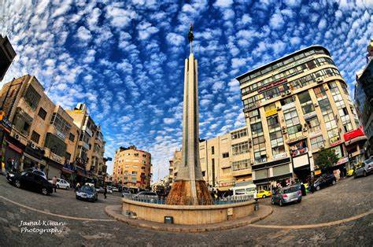

# **Flutter TerraPalestina Travel App**

**Flutter TerraPalestina Travel App** is a cross-platform mobile application designed for travelers to explore the beautiful landmarks, rich history, and vibrant culture of Palestine. Built with **Flutter**, this app provides users with detailed information about various tourist destinations, historical sites, and cultural experiences throughout Palestine. Whether you are a local or a visitor, the app serves as a digital guide, offering useful features like location-based recommendations, route planning, and more.

## **Features**

- 🌍 **Cross-Platform Support**: Developed using **Flutter**, the app runs seamlessly on both **iOS** and **Android**, ensuring a native-like experience on both platforms.

- 🗺️ **Explore Tourist Destinations**: The app features a curated list of tourist destinations, including historical landmarks, cultural sites, and scenic views across Palestine.

- 🧭 **Interactive Map**: An interactive map allows users to view locations of interest and navigate through different regions of Palestine. Get directions and find the best routes to your next destination.

- 📖 **Detailed Descriptions**: Each location comes with detailed information, including historical facts, opening hours, photos, and tips for visitors, making it easier to plan your trip.

- ⭐ **User Ratings and Reviews**: Travelers can rate locations and share their reviews, helping other visitors make informed decisions about where to go.

- 📱 **User-Friendly Interface**: A clean and modern design, optimized for mobile, ensures that users can easily browse locations, search for places, and access essential travel information.

- 🔔 **Notifications**: Stay updated with the latest travel news, special events, or promotions related to Palestinian tourism through push notifications.

- 🔍 **Search Functionality**: Easily search for specific locations, regions, or categories such as historical sites, restaurants, or natural reserves.

- 🛠️ **Offline Mode**: Certain features like maps and location details are available offline, so you can use the app even in areas with limited internet connectivity.

## **Technologies Used**

- **Flutter**: The app is built using Flutter, a powerful UI toolkit for building natively compiled applications for mobile from a single codebase.
- **Dart**: The programming language used to write the app.
- **Firebase**: Used for backend services, including user authentication and real-time data management (if applicable).
- **Google Maps API**: For displaying interactive maps and location-based services.
- **Push Notifications**: Managed through Firebase Cloud Messaging (FCM) for real-time alerts and updates.

## **Installation**

To run **Flutter TerraPalestina Travel App** locally on your device, follow these steps:

1. **Clone the repository** to your local machine:
   ```bash
   git clone https://github.com/Momen9Sarsour/Flutter-TerraPalestina-Travel-App.git
   ```

2. **Navigate to the project directory**:
   ```bash
   cd Flutter-TerraPalestina-Travel-App
   ```

3. **Install dependencies** by running:
   ```bash
   flutter pub get
   ```

4. **Run the app** on an emulator or a physical device:
   ```bash
   flutter run
   ```

5. Optionally, you can build the app for iOS or Android using the following commands:

   - For Android:
     ```bash
     flutter build apk
     ```

   - For iOS:
     ```bash
     flutter build ios
     ```

## **Customization**

If you want to customize the app, here are some options you can tweak:

- **Location Data**: Update the locations in the app by editing the data in the database or the API the app uses (e.g., Firebase, a custom API).
- **UI Customization**: Modify the app's theme, colors, and layout by adjusting the Flutter widgets and styles in the app.
- **Map Integration**: You can add more locations or integrate other mapping services by modifying the map-related code.
- **Notifications**: Configure Firebase Cloud Messaging (FCM) to manage notifications and events.

## **Project Images**

Here are some screenshots to showcase the app’s interface:

- 📸 **App Screenshot**:
  
  ---
  (assets/gabalgrezem.jpg)

## **Live Demo**

You can view a live demo of the app here (if applicable):

[Live Demo of Flutter TerraPalestina Travel App](https://example.com)

---

## **Example Usage**

Whether you're a **tourist** planning to visit Palestine, a **local traveler** exploring new places, or a **tourism enthusiast** looking to learn more about Palestine’s rich cultural heritage, **Flutter TerraPalestina Travel App** offers all the tools you need to enhance your journey. Explore Palestine’s landmarks, get directions, read reviews, and more, all from the convenience of your smartphone.

---

## 👤 **About Me**

**Momen Sarsour — Flutter Developer & Mobile App Designer**  
📧 Email: **momensarsour5@gmail.com**  
📱 WhatsApp: **+970567077179**

---
